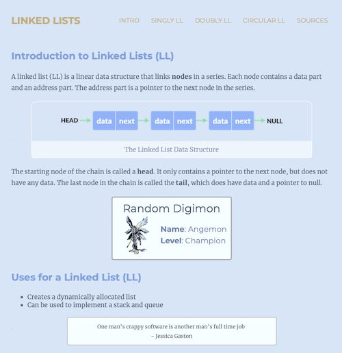

# CST336_hw4
Practice with Node.js and Express.  Original project was done in replit and code was downloaded to upload here.

- [X] Website includes 5 routes.
- [X] Website displays an API.  Digimon API used. (node-fetch#2.6)
- [X] Website displays data from a Node Package.  Hacker-quotes package used.
- [X] Used partials (header, navbar, footer, digimon, and quote)
- [X] There is a navigation menu on all pages.
- [X] Used an external CSS file.

